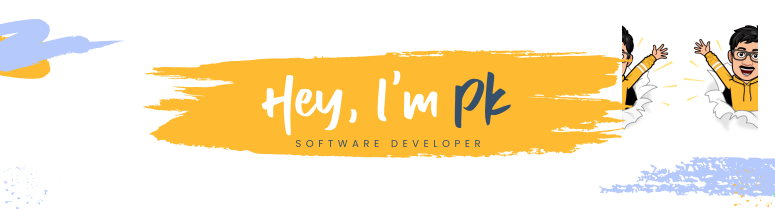

  

  
  

Welcome to my page!   I'm Pk, Software Developer from  <b>Hyderabad, India.</b> Currently pursuing BE 3rd Year <a href="cbit.ac.in">@CBIT</a>

- 🔭 I’m currently working on [CBIT Bus Tracking](https://github.com/pkitachi/BusTracking-CBIT)
- 🌱 I’m currently learning [React](https://reactjs.org/)
- 🤝 I’m open to collaborate on any opensource project
- 💬 Ask me about anything, I'm happy to help
- 😄 Pronouns: he/him

### Things I code with

  
  <!--Languages-->
  
  
  
  
  
  
  
  
  
  <!--Frameworks-->
  
  
  
  

  
GitHub Related Stats

   
  

  
  
     

<!--SOCIAL-->

    <i>Let's connect and chat! Open to anything under the sun.</i> 
    
    
    

